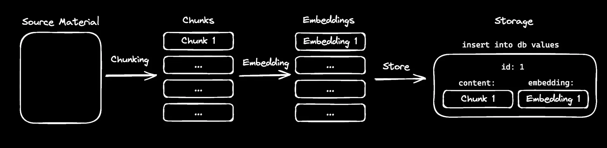
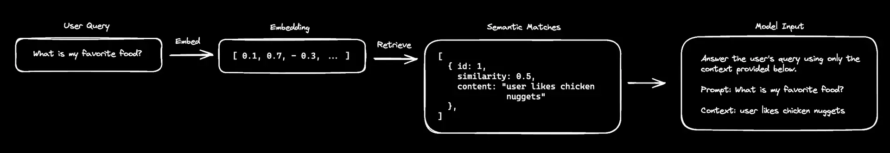
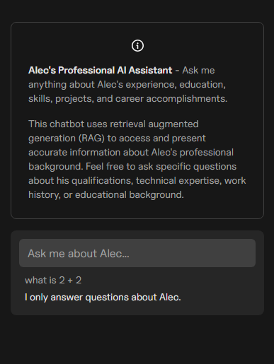

# 🤖 **RAG Chatbot - Answers Questions About Alec**

🚀 **Live Demo:** [AlecBytes/chatbot](https://alecbytes.com/chatbot)

📝 Currently building a chatbot that uses retrieval-augmented generation (RAG) to reason and respond with information outside of the model's training data. I kicked things off with a [Vercel AI SDK template](https://vercel.com/templates/next.js/ai-sdk-rag), tweaked the model prompt, and chunked & embedded my resume info in a vector database. After testing prompt responses on a working prototype, I'm now fine-tuning and adding more information chunks. Next up, I'll re-embed the updated chunks and see how they boost the chatbot’s responses.

If you're into AI or chatbots, let's connect and share insights!

## ⭐ **Please Star This Project**  ⭐

If you find this project useful, consider **starring** ⭐ the repo! Your support helps others discover it and motivates further development. Thank you! 🙏  

## 💡 **How it works**

### Store the Context the Model does not have

### Retrieve stored context similar to query, combine into new query

## ✨ **Features**

- Information retrieval and addition through tool calls using the [`streamText`](https://sdk.vercel.ai/docs/reference/ai-sdk-core/stream-text) function
- Real-time streaming of model responses to the frontend using the [`useChat`](https://sdk.vercel.ai/docs/reference/ai-sdk-ui/use-chat) hook
- Vector embedding storage with [DrizzleORM](https://orm.drizzle.team/) and [PostgreSQL](https://www.postgresql.org/)
- Animated UI with [Framer Motion](https://www.framer.com/motion/)

## 📷 **Images of the App**

## 💻 **Tech Stack**

### 🎨 Frontend

- [Next.js](https://nextjs.org/) - React framework
- [Tailwind CSS](https://tailwindcss.com/) - CSS framework
- [Radix UI](https://www.radix-ui.com/) - Unstyled, accessible components
- [Framer Motion](https://www.framer.com/motion/) - Animation library

### 🤖 AI/ML

- [Vercel AI SDK](https://sdk.vercel.ai/) - Core AI functionality
  - [`useChat`](https://sdk.vercel.ai/docs/reference/ai-sdk-ui/use-chat) hook for frontend chat interface
  - [`streamText`](https://sdk.vercel.ai/docs/reference/ai-sdk-core/stream-text) function for streaming responses
- [OpenAI API](https://openai.com/) (GPT-4o model)

### 💾 Database

- [PostgreSQL](https://www.postgresql.org/) - Vector database storage
- [DrizzleORM](https://orm.drizzle.team/) - Database ORM

### 🌍 Deployment

- [Vercel](https://vercel.com/) - Hosting platform
- [Supabase](https://supabase.com/) - PostgreSQL vector database provider

## 📜 **License**

This project is **not open-source**, and no license is granted for reuse, modification, or distribution.  

If you are looking to build a similar chatbot, please refer to the official [Vercel Guide](https://sdk.vercel.ai/docs/guides/rag-chatbot) and its starter code. The modifications in this repository are tailored to my specific needs, and you should create your own custom implementation.

## 🤝 **Credits**

The starter code and images used in this project are sourced from [Vercel's Guide](https://sdk.vercel.ai/docs/guides/rag-chatbot).
